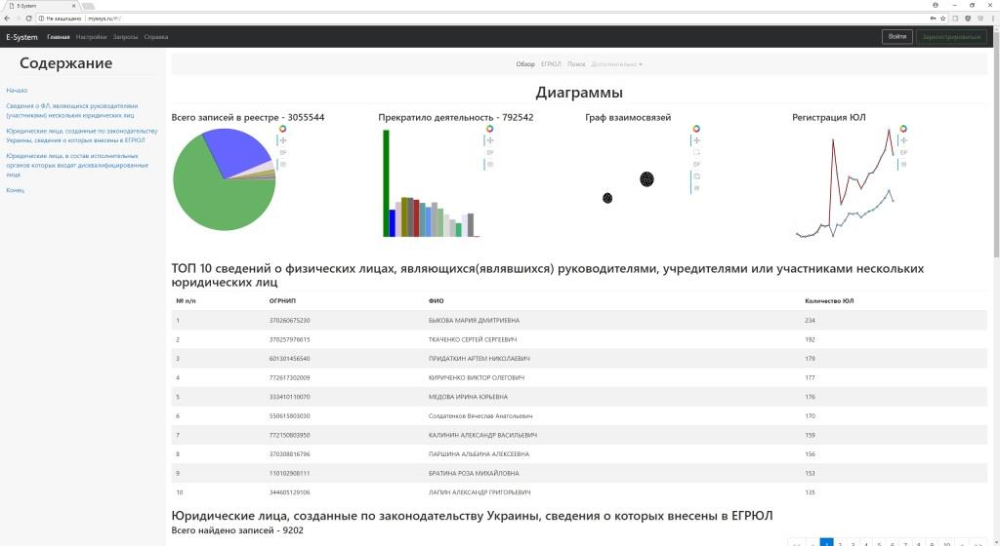
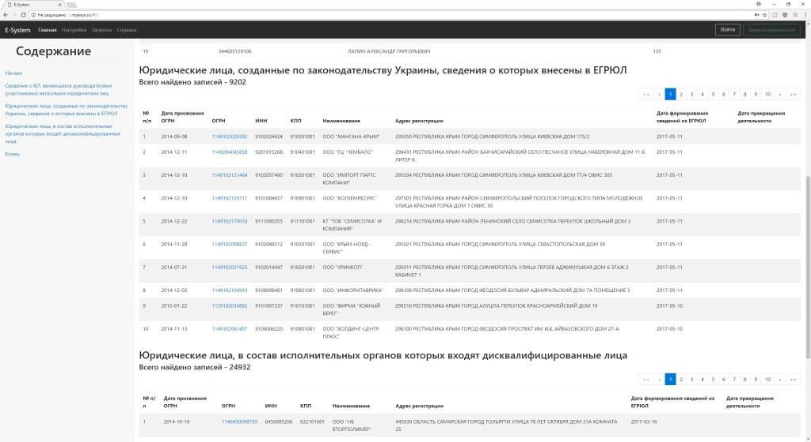
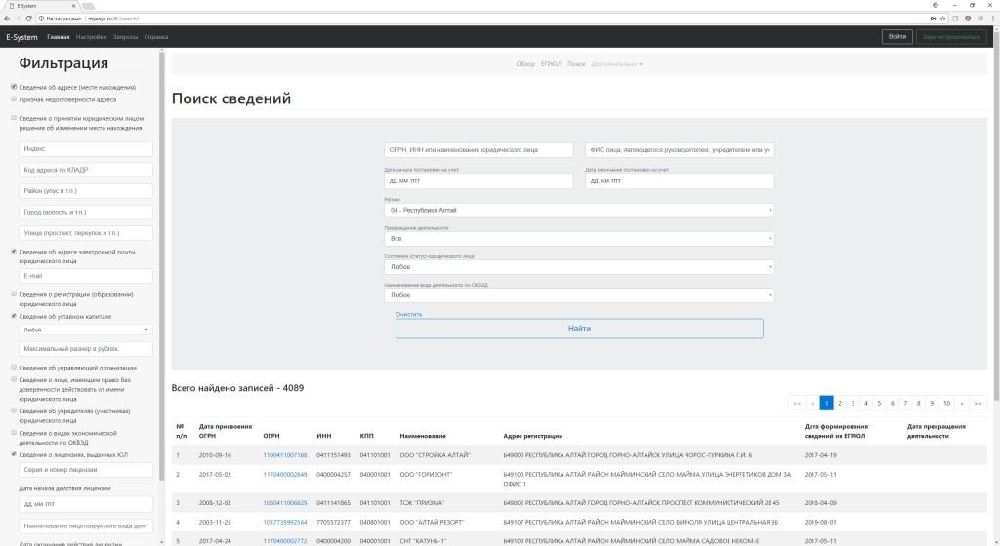
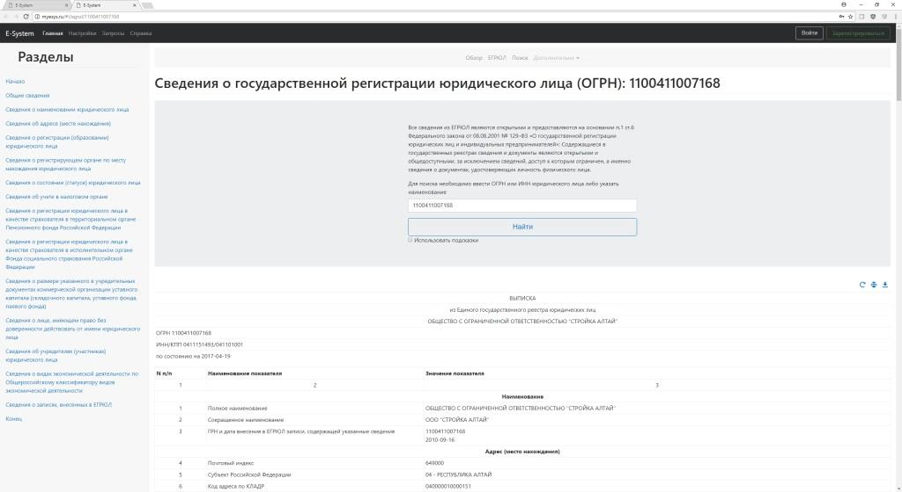

### Краткое описание
Код предназначен для парсинга и сохранения открытых сведений из ЕГРЮЛ (XML-файлы, выгружаемых ФНС России).
Хранение организовано в реляционной БД (в моем случае PostgreSQL) с разбором информации до уровня каждого поля данных.
На основе хранимых данных реализована аналитически-поисковая Web-система.
Представление данных (Выписок) в HTML и PDF видах ведется с помощью XSLT-предобразования оригинала.
Реализовано построение некоторых графических диаграмм, фильтрации данных по совокупности различных параметров.

### Скриншоты

### Перспективы развития
* Оптимизация и наведение порядка в коде
* Создание личного кабинета пользователя
* Обновление данных по запросу

Код распространяется как есть. Связь с разработчиком <kmakeev@arbitr.ru> 

